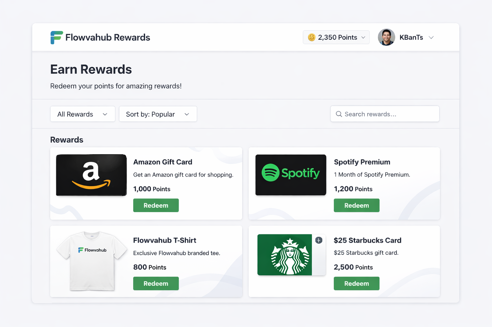

# 🎁 FlowvaHub Rewards

A modern, full-featured rewards management platform built with React, TypeScript, and Supabase. Users can browse available rewards, track their points balance, and claim rewards through an intuitive and responsive interface.

## 📸 Screenshot


*Placeholder screenshot showing the rewards catalog interface*

## 🌐 Live Demo

**[View Live Application](#)** *(URL to be added)*

## ✨ Features

### User Authentication
- **Secure Sign-Up & Sign-In**: Email-based authentication powered by Supabase Auth
- **Session Persistence**: Automatic session management with token refresh
- **Sign-Out Functionality**: Secure logout with session cleanup

### Rewards Management
- **Browse Rewards**: View all active rewards in a responsive grid layout
- **Real-Time Points Balance**: Display current user points with live updates
- **Reward Details**: Each reward shows title, description, point cost, and category
- **Stock Tracking**: Visual indicators for reward availability and remaining stock

### Reward Claiming
- **Claim Confirmation Modal**: Verify reward claims before processing
- **Status Indicators**: 
  - ✓ Claimed - Already claimed rewards
  - Need X more - Insufficient points required
  - Out of Stock - Unavailable rewards
  - Available - Ready to claim
- **Claim History**: View when rewards were claimed with timestamps
- **Real-Time Updates**: Automatic refresh of rewards and points after claiming

### User Experience
- **Loading States**: Smooth loading spinners during data fetching
- **Error Handling**: Comprehensive error messages with retry functionality
- **Empty States**: Friendly messaging when no rewards are available
- **Responsive Design**: Fully responsive layout for mobile, tablet, and desktop
- **Smooth Animations**: Hover effects, transitions, and loading animations

## 🛠️ Tech Stack

### Frontend
- **React 19.2.0** - UI library with latest features
- **TypeScript 5.9.3** - Type-safe development
- **Vite 7.2.4** - Lightning-fast build tool and dev server
- **Tailwind CSS 3.4.19** - Utility-first CSS framework
- **PostCSS 8.5.6** - CSS transformation
- **Autoprefixer 10.4.23** - Vendor prefix automation

### Backend & Database
- **Supabase** - Open-source Firebase alternative
  - PostgreSQL database
  - Real-time subscriptions
  - Authentication system
  - RPC functions for reward claiming

### Development Tools
- **ESLint 9.39.1** - Code quality and consistency
- **TypeScript ESLint 8.46.4** - TypeScript-specific linting
- **React Hooks ESLint Plugin** - React best practices enforcement

## 📋 Project Structure

```
flowvahub-rewards/
├── src/
│   ├── App.tsx                 # Main application component
│   ├── index.css               # Global styles with Tailwind directives
│   ├── main.tsx                # React entry point
│   ├── App.css                 # Component-specific styles
│   ├── index.css               # Global CSS
│   └── assets/
│       └── react.svg           # React logo
├── public/
│   ├── vite.svg                # Vite logo
│   └── rewards_page_screenshot.png  # Application screenshot
├── index.html                  # HTML entry point
├── package.json                # Project dependencies
├── tsconfig.json               # TypeScript configuration
├── tsconfig.app.json           # App-specific TypeScript config
├── tsconfig.node.json          # Node-specific TypeScript config
├── vite.config.ts              # Vite configuration
├── tailwind.config.js          # Tailwind CSS configuration
├── postcss.config.js           # PostCSS configuration
├── eslint.config.js            # ESLint configuration
├── .env.example                # Environment variables template
├── .env.local                  # Local environment variables (not committed)
└── README.md                   # This file
```

## 🚀 Getting Started

### Prerequisites
- Node.js 16.x or higher
- npm or yarn package manager
- Supabase account with configured project

### Installation

1. **Clone the repository**
   ```bash
   git clone <repository-url>
   cd flowvahub-rewards
   ```

2. **Install dependencies**
   ```bash
   npm install
   ```

3. **Configure environment variables**
   - Copy `.env.example` to `.env.local`
   - Add your Supabase credentials:
     ```env
     VITE_SUPABASE_URL=your_supabase_url_here
     VITE_SUPABASE_ANON_KEY=your_supabase_anon_key_here
     ```

4. **Start the development server**
   ```bash
   npm run dev
   ```
   The application will be available at `http://localhost:5173`

## 📦 Available Scripts

### Development
```bash
npm run dev
```
Starts the Vite development server with hot module replacement (HMR).

### Build
```bash
npm run build
```
Compiles TypeScript and builds the application for production.

### Preview
```bash
npm run preview
```
Previews the production build locally.

### Linting
```bash
npm run lint
```
Runs ESLint to check code quality and consistency.

## 🏗️ Architecture

### Component Hierarchy

```
App
└── RewardsPage
    ├── RewardsHeader (displays points balance and sign-out)
    ├── RewardsList (grid of reward cards)
    │   ├── RewardCard (individual reward display)
    │   └── ClaimModal (confirmation dialog)
    ├── EmptyState (no rewards available)
    ├── LoadingSpinner (data loading state)
    └── ErrorMessage (error display with retry)
```

### Custom Hooks

#### `useAuth()`
Manages user authentication state and session persistence.
- Returns: `{ user, loading, isAuthenticated, signOut }`

#### `useUserProfile(userId)`
Fetches and subscribes to user profile updates in real-time.
- Returns: `{ profile, loading, error }`

#### `useRewards(userId)`
Fetches rewards with claim status and subscribes to updates.
- Returns: `{ rewards, loading, error, refetch }`

#### `useClaimReward()`
Handles reward claiming via Supabase RPC function.
- Returns: `{ claimReward, loading, error }`

### Data Types

```typescript
interface Reward {
  id: string;
  title: string;
  description: string;
  points_required: number;
  image_url: string | null;
  category: string;
  is_active: boolean;
  stock_quantity: number | null;
  display_order: number;
}

interface UserProfile {
  id: string;
  points_balance: number;
  display_name: string | null;
}

type ClaimStatus = 'available' | 'claimed' | 'insufficient_points' | 'unavailable';
```

## 🗄️ Database Schema

### Tables Required

#### `user_profiles`
- `id` (UUID, Primary Key)
- `points_balance` (Integer)
- `display_name` (Text, nullable)

#### `rewards`
- `id` (UUID, Primary Key)
- `title` (Text)
- `description` (Text)
- `points_required` (Integer)
- `image_url` (Text, nullable)
- `category` (Text)
- `is_active` (Boolean)
- `stock_quantity` (Integer, nullable)
- `display_order` (Integer)

#### `reward_claims`
- `id` (UUID, Primary Key)
- `user_id` (UUID, Foreign Key)
- `reward_id` (UUID, Foreign Key)
- `claimed_at` (Timestamp)

### RPC Function

#### `claim_reward(reward_uuid UUID)`
Handles the reward claiming logic with validation and point deduction.

**Response:**
```typescript
{
  success: boolean;
  error?: string;
  claim_id?: string;
  new_balance?: number;
}
```

## 🎨 Styling

The application uses **Tailwind CSS** for styling with a modern, professional design:

- **Color Scheme**: Blue and purple gradients with neutral grays
- **Responsive Breakpoints**: Mobile-first design with md and lg breakpoints
- **Components**: Pre-built Tailwind components for buttons, cards, modals, and forms
- **Animations**: Smooth transitions and loading spinners

### Key Tailwind Features Used
- Gradient backgrounds
- Backdrop blur effects
- Shadow utilities
- Responsive grid layouts
- Hover and transition states
- Disabled state styling

## 🔐 Security Considerations

- **Environment Variables**: Sensitive credentials stored in `.env.local` (not committed)
- **Supabase Auth**: Leverages Supabase's secure authentication system
- **Session Management**: Automatic token refresh and session persistence
- **RPC Functions**: Server-side validation of reward claims
- **Type Safety**: TypeScript prevents runtime type errors

## 🐛 Error Handling

The application includes comprehensive error handling:

- **Network Errors**: Graceful error messages with retry functionality
- **Authentication Errors**: Clear feedback for login/signup failures
- **Data Fetching Errors**: Detailed error messages for database operations
- **Validation Errors**: User-friendly messages for invalid operations

## 📱 Responsive Design

The application is fully responsive across all device sizes:

- **Mobile** (< 768px): Single column layout
- **Tablet** (768px - 1024px): Two column grid
- **Desktop** (> 1024px): Three column grid

## 🔄 Real-Time Features

- **Live Profile Updates**: User points balance updates in real-time
- **Reward Status Changes**: Reward availability updates automatically
- **Claim Notifications**: Immediate feedback on successful claims

## 🚀 Performance Optimizations

- **Code Splitting**: Vite automatically optimizes bundle splitting
- **Lazy Loading**: Components load on demand
- **Memoization**: `useCallback` prevents unnecessary re-renders
- **Efficient Queries**: Parallel data fetching with `Promise.all()`

## 📚 Dependencies

### Production
- `@supabase/supabase-js` - Supabase client library
- `react` - UI library
- `react-dom` - React DOM rendering

### Development
- `@vitejs/plugin-react` - Vite React plugin
- `tailwindcss` - CSS framework
- `typescript` - Type checking
- `eslint` - Code linting
- And other development tools

## 🤝 Contributing

Contributions are welcome! Please follow these guidelines:

1. Fork the repository
2. Create a feature branch (`git checkout -b feature/amazing-feature`)
3. Commit your changes (`git commit -m 'Add amazing feature'`)
4. Push to the branch (`git push origin feature/amazing-feature`)
5. Open a Pull Request

## 📝 License

This project is licensed under the MIT License - see the LICENSE file for details.

## 🆘 Troubleshooting

### Tailwind CSS not working
- Ensure `postcss.config.js` is properly configured
- Restart the development server after configuration changes
- Clear the `.vite` cache if styles don't update

### Supabase connection errors
- Verify environment variables in `.env.local`
- Check Supabase project is active and accessible
- Ensure database tables and RPC functions are created

### Authentication issues
- Clear browser cookies and local storage
- Verify Supabase Auth configuration
- Check email/password requirements (minimum 6 characters)

### Rewards not loading
- Verify database tables have data
- Check user has proper permissions in Supabase
- Review browser console for detailed error messages

## 📞 Support

For issues, questions, or suggestions, please open an issue on the repository or contact the development team.

---

**Built with ❤️ using React, TypeScript, and Supabase**
